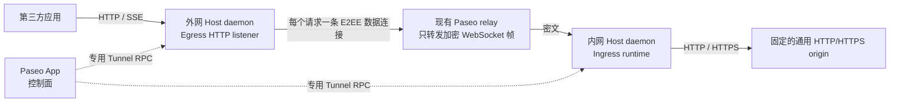
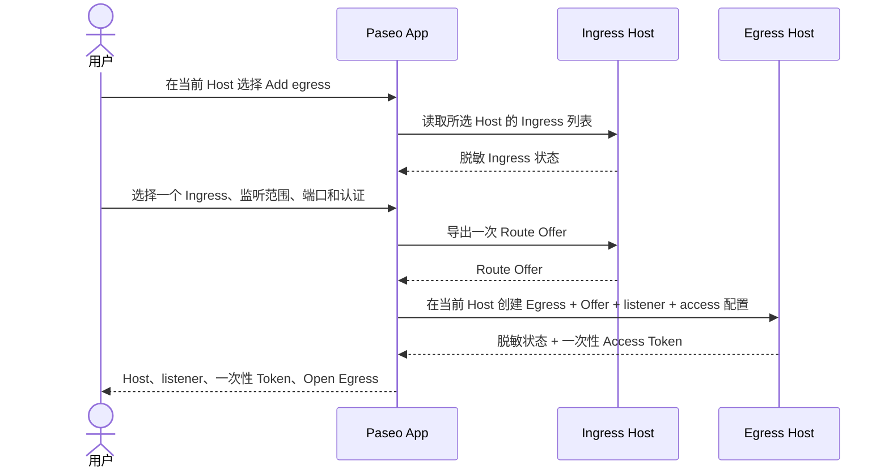
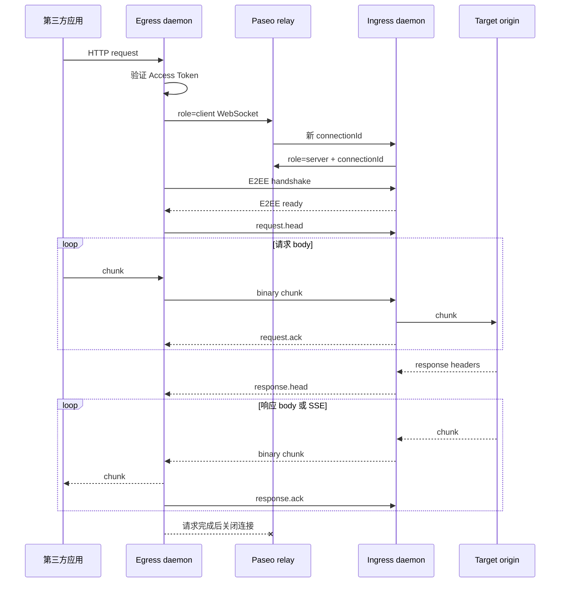
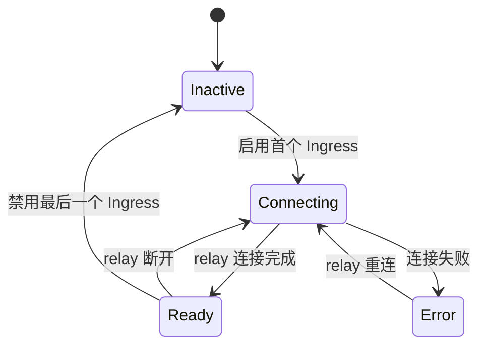
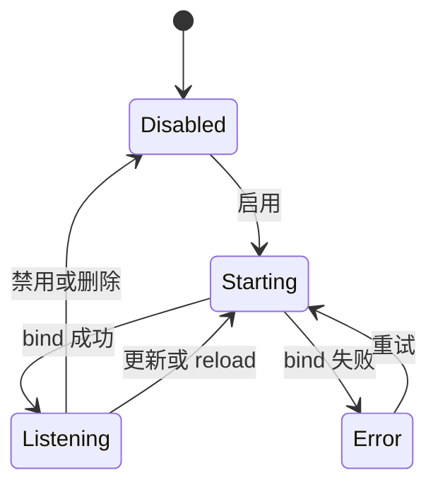

# Paseo HTTP Proxy Tunnel 设计

## 1. 结论

Paseo 在 Host 设置中提供内建的 `Tunnel` 功能。它通过现有 relay 和 E2EE，把外网 Host 上的一个 HTTP listener 连接到内网 Host 上的一个固定 HTTP/HTTPS origin。

- **Ingress** 属于能访问内网目标服务的 Host。一个 Ingress 只绑定一个 origin。
- **Egress** 属于能被第三方访问的 Host。一个 Egress 只监听一个 `host:port`，并只指向一个 Ingress。
- 一个 Ingress 可以被多个 Egress 使用。
- 同一个 Host 可以同时承担两个角色，也允许流量绕 relay 回到同一 Host。
- Paseo App 只承担控制面；daemon 承担监听、加密和转发。
- relay 服务和 relay wire contract 零修改。

Tunnel 是隔离的内建核心模块，不使用本地插件实现。插件不能在 Host 设置中提供固定位置，也不能从一个 Host 的 surface 配置另一个 Host。

## 2. 范围

### 2.1 目标

- 在 Host 设置菜单最后增加 `Tunnel`。
- 代理任意符合 HTTP/1.1 语义的 HTTP/HTTPS 服务。
- 保持 method、path、query、端到端 headers 和 body。
- 流式传输请求体、响应体和 SSE，不聚合完整 body。
- 复用现有 relay v2、E2EE、relay endpoint、Host 设置组件和配置存储。
- 禁止外部请求选择或覆盖内网目标。
- daemon 重启后恢复启用的 Ingress 和 Egress。

### 2.2 非目标

第一版不提供：

- 访问日志
- 速率限制
- 并发数或连接数限制
- HTTP 请求超时分级
- 目标健康检查
- 优雅重载
- 缓存、负载均衡或自动重试
- HTTP/2、gRPC 或 CONNECT 正向代理
- WebSocket Upgrade
- 内建公网 TLS 终止
- 虚拟主机、路径路由或路径重写
- `paseo tunnel` CLI

修改、禁用、删除或 reload 配置时，可以直接中断活动请求。

## 3. 总体架构



数据面不经过 App。关闭移动端、浏览器或桌面窗口不会中断已经运行的代理。

Ingress daemon 在至少一个 Ingress 启用时维护一条 Tunnel relay 控制连接。该连接独立于 `daemon.relay.enabled`；关闭 Paseo 远程控制连接不会关闭 Tunnel。

## 4. 用户配置流程

### 4.1 首选：在 Egress Host 添加出口

用户打开将要运行 Egress listener 的 Host 设置页，选择 Ingress Host，再选择该 Host 上已配置的一个 Ingress。当前 Host 是 Egress Host，不在表单中重复选择。App 必须同时连接 Egress Host 和所选 Ingress Host。



完成后仍停留在当前 Egress Host 页面。结果卡紧接刚提交的创建或更换表单显示来源 Ingress Host、Ingress、listener 和只出现一次的 Access Token，不跳到页面顶部。Token 用可选中的等宽高亮文本显示，并提供 `Copy Token`；自动生成的值以 `pat-` 为前缀。结果卡可选提供 `Open Egress`。

Ingress 和 Egress 的 `Enabled` 分别只控制各自 daemon 中的 runtime。Ingress 停用时 Egress 保留配置和 listener，但请求无法转发；Egress 停用时当前 Host 不监听该端口。配置操作使用 `Add egress`，不使用 `Expose on another host`。

Ingress Host picker 只列出当前已连接且 `server_info.features.httpTunnel === true` 的 Host。允许选择当前 Host，此时同一 daemon 同时承担 Ingress 和 Egress，数据面仍经过 relay。

### 4.2 备用：Route Offer 复制和导入

不能同时连接两个 Host 时：

1. 在 Ingress 行上选择 `Copy Route Offer`。
2. 切换到 Egress Host。
3. 选择 `Import egress` 并粘贴 Offer。

`Import egress` 只负责导入 Offer，不重复提供跨 Host picker。Route Offer 是管理员能力凭据，按密码处理；普通列表、状态广播和日志不得包含它。

## 5. 产品模型和界面

### 5.1 菜单和路由

路由固定为：

```text
/settings/hosts/[serverId]/tunnel
```

`Tunnel` 是 Host 设置的最后一个菜单项，位于 `Plugins` 之后。页面只操作路由中 `serverId` 对应的 Host。

页面沿用现有 Host 设置布局和 720px 内容列，按顺序垂直展示两个 `SettingsSection`：

1. `Ingress`
2. `Egress`

不增加 tab 或二级 sidebar。Compact 布局沿用现有 Host 设置的全屏详情和返回导航。

### 5.2 Ingress section

Section header 显示共享 relay 状态：`Inactive`、`Connecting`、`Ready` 或 `Error`。状态只表示 Tunnel relay 控制连接，不探测目标 origin。

每行只显示：

- 名称
- Target Origin
- `Enabled` 或 `Disabled`

每行提供编辑、启用/禁用、复制 Route Offer、旋转 route secret 和删除。Ingress daemon 不提供创建 Egress 的 RPC。

不显示 `Exposed` 或 `Not exposed`。Ingress 无法知道 Offer 是否被复制到未连接的 Egress。

### 5.3 Egress section

每行显示名称、来源 Ingress Host、来源 Ingress、listener、认证模式、Enabled/Disabled 和实际 listener 状态。每行提供编辑、启用/禁用、替换 Route Offer、更换 Access Token 和删除。

Listener 表单将地址拆成监听范围和端口：

- `Local only` 对应 `127.0.0.1`，是默认值。
- `All network interfaces` 对应 `0.0.0.0`，保存前显示明确的网络暴露警告。它表示监听全部网卡，不绕过操作系统防火墙、云安全组或网络路由。

默认端口取所选 Ingress Target Origin 的有效端口：显式端口原样使用，未显式填写时 `http` 使用 `80`、`https` 使用 `443`。用户可以修改。不自动寻找空闲端口。当 Ingress 和 Egress 在同一 Host 且默认 listener 冲突时，保留建议值并在保存失败后提示修改，不静默换端口。第一版不提供任意 bind address 输入。

每个 Egress 拥有自己的 `host:port`。第一版没有基于 Host header 或 path 的共享 listener 路由。

### 5.4 表单规则

- Ingress 和 Egress 的 Create/Edit 分别使用独立 form model 和现有 form kit。
- 在当前 Host 选择 `Add egress`后，表单依次选择 Ingress Host、该 Host 上的一个 Ingress、监听范围、端口和认证。Egress 固定创建在当前 Host。
- 切换 Ingress 时，端口重置为新 Target Origin 的有效端口，之后允许用户修改。
- `Import egress` 是不能同时连接两个 Host 时的 Route Offer 导入入口，不重复提供 Ingress Host 或 Ingress picker。
- 一个 Egress 只持有一份 Route Offer 并只指向一个 Ingress。第一版不提供 Ingress pool、负载均衡或故障转移。需要多实例时，在 Ingress Target Origin 之前部署 Nginx 等上游反向代理，Tunnel 仍只看到一个固定 origin。
- 同一 Host 内，Ingress 名称在 Ingress 中唯一，Egress 名称在 Egress 中唯一。
- 新条目默认 Enabled。
- 保存期间禁止重复提交。
- runtime 启动失败时保留表单输入，显示错误，不持久化本次 mutation。
- 删除、旋转 route secret 和选择 `none` 认证需要确认。
- Access Token 生成后只显示一次；丢失后只能更换。

## 6. 通用 HTTP 和访问认证

Tunnel 只有一种通用 HTTP 模式。Ingress、Egress、Route Offer、wire protocol 和 runtime 都不保存或判断服务类型。

Egress 单独配置第三方访问认证：

| 模式     | 调用方凭据                      | 上游行为                                                 |
| -------- | ------------------------------- | -------------------------------------------------------- |
| `header` | `X-Paseo-Access-Token: <token>` | 校验并移除 Tunnel token header，保留业务 `Authorization` |
| `bearer` | `Authorization: Bearer <token>` | 校验后原样转发 `Authorization`                           |
| `none`   | 不校验                          | 端到端 headers 按普通转发规则处理                        |

`header` 是默认模式，适合目标服务已经使用 `Authorization` 的情况。`bearer` 是通用的 Bearer 透传方式；如果目标也校验相同凭据，用户可以输入目标现有 token。`none` 必须由用户显式选择。

出口访问控制只保护 Egress listener，不替代 Ingress Target Origin 的认证。`header` 模式下，调用方用 `X-Paseo-Access-Token` 访问 Tunnel，同时可以用 `Authorization` 或其他业务 header 访问目标服务。Ingress 不保存、生成或注入目标服务凭据；这些凭据由调用方随请求提供。

需要 token 时，创建表单默认由 Egress daemon 生成高熵、以 `pat-` 开头的 Access Token，也允许用户输入自定义值。自动生成的值只在创建成功响应中显示一次；自定义值由 App 通过专用 mutation 发送，不进入 App 持久化或普通状态。认证模式只影响 Egress 的访问控制和对应 header，不改变 HTTP 转发协议。

## 7. 身份和凭据

### 7.1 Tunnel identity

daemon 在创建第一个 Ingress 时生成一套只供 Tunnel 使用的身份：

```text
tunnelServerId
tunnelPublicKey
tunnelSecretKey
```

它独立于 Paseo daemon 控制连接使用的 `serverId` 和 keypair。删除全部 Ingress 后仍永久保留该 identity，避免 route 生命周期意外改变 Host 的 Tunnel 身份。

### 7.2 Route capability

每个 Ingress 持有：

```text
routeId
routeSecret
```

Route Offer 包含：

```text
protocolVersion
relayPublicEndpoint
relayPublicUseTls
tunnelServerId
tunnelPublicKey
routeId
routeSecret
ingressHostName
ingressName
suggestedPort
```

Offer 使用导出时已经解析的 `publicEndpoint` 和 `publicUseTls`。以后修改 Ingress Host 的 relay endpoint，不会更新已存在的 Egress。`ingressHostName` 和 `ingressName` 只作为 Egress UI 的来源标签，`suggestedPort` 是 Target Origin 的有效端口。它们都是导出时的快照；Host 或 Ingress 重命名不会自动更新已存在 Egress 中的标签，替换 Offer 时更新。实际映射仍只使用 `routeId + routeSecret`。

旋转 Ingress route secret 会立即使所有旧 Offer 和全部旧 Egress 失效，不自动分发新 secret。用户必须把新 Offer 手动替换到每个 Egress。删除 Ingress 不级联删除 Egress；旧 Egress 请求返回 `502 Bad Gateway`。

### 7.3 Tunnel Access Token

Access Token 只授权第三方调用一个 Egress，不授权连接 Ingress。daemon 只保存 token hash，不保存或返回明文。

普通 Edit Egress 表单只显示 `Configured`，不回填 token。`Replace Token` 是独立操作，不是普通编辑字段：用户选择自动生成或输入新值，保存后旧 token 对新请求立即失效。成功结果紧接该操作表单显示，Token 值可选中并有 `Copy Token` 按钮；新的自动生成 token 同样只显示一次，丢失后只能再次替换。

Route Offer 和 Tunnel Access Token 是两种独立凭据。旋转 Egress Access Token 不影响 Ingress route secret。

## 8. HTTP 请求数据流

每个外部 HTTP 请求建立一条新的 relay WebSocket 和 E2EE channel。一条数据连接只承载一个 HTTP 请求，不做连接池或多路复用。



Egress 在 E2EE ready 前暂停读取请求 body。每个方向最多允许 8 个未确认的 64 KiB chunk；窗口满时，发送方暂停读取 HTTP stream。接收方把 chunk 写入下游并处理 Node stream `drain` 后发送对应 ack。`WebSocket.send`、`EncryptedChannel.send` 和 `bufferedAmount` 不能单独把下游背压穿过 relay，也不能作为内存上界。

任意一侧断开时销毁另一侧请求和流，不自动重试。

真实 prototype 的方法和结果见 [`packages/server/src/server/tunnel/tunnel-data-plane.prototype.md`](../../packages/server/src/server/tunnel/tunnel-data-plane.prototype.md)。逐请求连接满足第一版，但数据协议必须提供上述双向窗口。持久连接和多路复用留到生产延迟或并发要求否定逐请求模型时再评估。

## 9. Tunnel 数据协议

协议运行在现有 E2EE channel 内。relay 只能观察连接元数据、时间和密文大小。

| 方向             | WebSocket frame      | 含义                          |
| ---------------- | -------------------- | ----------------------------- |
| Egress → Ingress | 文本 `request.head`  | 请求元数据和 route credential |
| Egress → Ingress | 二进制               | 请求 body chunk               |
| Egress → Ingress | 文本 `request.end`   | 请求 body 结束                |
| Ingress → Egress | 文本 `request.ack`   | 确认请求 body chunk           |
| Ingress → Egress | 文本 `response.head` | 状态码和 headers              |
| Ingress → Egress | 二进制               | 响应 body chunk               |
| Ingress → Egress | 文本 `response.end`  | 响应结束                      |
| Egress → Ingress | 文本 `response.ack`  | 确认响应 body chunk           |
| 双向             | 文本 `error`         | 请求无法继续                  |

```ts
interface TunnelRequestHead {
  v: 1;
  type: "request.head";
  routeId: string;
  routeSecret: string;
  method: string;
  path: string;
  headers: Array<[name: string, value: string]>;
  client: {
    address: string | null;
    host: string | null;
    protocol: "http";
  };
}

interface TunnelResponseHead {
  v: 1;
  type: "response.head";
  statusCode: number;
  statusMessage?: string;
  headers: Array<[name: string, value: string]>;
}

interface TunnelChunkAck {
  v: 1;
  type: "request.ack" | "response.ack";
  bytes: number;
}
```

`path` 必须是 origin-form，例如 `/api/events?stream=true`。拒绝 absolute-form、authority-form、`CONNECT` 和 Upgrade。

Headers 使用有序 tuple 列表，保留重复字段。每个方向只允许协议规定的帧顺序。单个明文 binary chunk 最大 64 KiB；较大的 Node stream chunk 在发送前拆分。每个方向的发送方最多保留 8 个未确认 chunk，ack 必须按顺序确认准确的 plaintext byte 数。所有 body chunk 被确认后才能发送对应的 `request.end` 或 `response.end`。

`error` 只包含固定 code，例如 `INVALID_REQUEST`、`ROUTE_NOT_FOUND`、`ROUTE_UNAUTHORIZED`、`UPSTREAM_UNAVAILABLE`、`UPSTREAM_TLS_ERROR` 或 `INTERNAL_ERROR`。不得包含地址、凭据、堆栈或内部错误文本。

## 10. HTTP 转发语义

### 10.1 Target Origin

Ingress 只接受 origin：

```text
http://host[:port]
https://host[:port]
```

必须有 hostname；禁止 username、password、query、fragment 和 `/` 以外的 pathname。保存时只做格式校验，不探测目标。

外部 path 和 query 原样附加：

```text
Target Origin: http://10.0.0.5:8000
External Path: /api/events?stream=true
Upstream URL:  http://10.0.0.5:8000/api/events?stream=true
```

### 10.2 Headers

Egress 和 Ingress 移除 RFC hop-by-hop headers，以及 `Connection` header 点名的字段。Ingress 将 `Host` 改为目标 origin authority，并用 Egress 观察到的值重建 `X-Forwarded-For`、`X-Forwarded-Host` 和 `X-Forwarded-Proto`，不信任调用方提供的同名字段。

认证 header 按 Egress 的 `access.mode` 处理。其他端到端 headers 和重复 response headers 原样转发。

### 10.3 Body 和连接

- request/response body 不落盘、不完整缓存、不解压、不重新压缩。
- SSE chunk 到达后立即向下游写入。
- 不添加代理级 HTTP deadline。
- relay transport 现有的连接和 E2EE 安全超时继续生效，但不扩展为 HTTP 超时分级。
- 上游 4xx/5xx 原样转发。

## 11. 持久化

Tunnel 配置保存在现有 `$PASEO_HOME/config.json` 的 `daemon.tunnel` 下：

```ts
interface PersistedTunnelConfig {
  identity?: {
    serverId: string;
    publicKeyB64: string;
    secretKeyB64: string;
  };
  ingresses?: Array<{
    id: string;
    name: string;
    enabled: boolean;
    targetOrigin: string;
    routeId: string;
    routeSecret: string;
  }>;
  egresses?: Array<{
    id: string;
    name: string;
    enabled: boolean;
    listen: { host: string; port: number };
    offer: {
      protocolVersion: 1;
      relayEndpoint: string;
      relayUseTls: boolean;
      tunnelServerId: string;
      tunnelPublicKeyB64: string;
      routeId: string;
      routeSecret: string;
      ingressHostName: string;
      ingressName: string;
      suggestedPort: number;
    };
    access: {
      mode: "bearer" | "header" | "none";
      tokenHash?: string;
    };
  }>;
}
```

没有全局 `tunnel.enabled`；每个 entry 的 `enabled` 决定运行状态。`identity` 在第一次创建 Ingress 时写入，此后不删除。

不持久化推导出的 public URL。Paseo 只知道 Egress 的 HTTP listener，无法知道外部 TLS、域名或反向代理最终暴露的 URL。

现有 `config.json` 写入已经使用同目录临时文件加 rename，POSIX 文件权限为 `0600`，父目录为 `0700`。Tunnel 不创建第二个 store 或 writer。所有 Tunnel mutation 必须在 `DaemonConfigStore` 内与普通配置写入串行化，避免两个 read-modify-write 相互覆盖。

`config.json` 是备份和持久化格式，不承诺用户可以从空白手写完整 Tunnel 配置。正常管理使用专用 RPC。

### 11.1 配置和 secret 边界

Tunnel secret 不进入 `MutableDaemonConfig`，也不通过通用 daemon config get/set 或配置变更广播返回 App。

普通 Tunnel DTO 不返回：

- Tunnel secret key
- route secret
- 完整 Route Offer
- Access Token 或 token hash

只有显式 export RPC 返回 Route Offer。只有 create/rotate Egress Access Token 的成功响应返回一次性明文 token。

UI mutation 必须按 entry ID 操作，不能把脱敏后的 `ingresses` 或 `egresses` 整个数组写回，否则会擦除 server-only secret。

### 11.2 `paseo reload`

`paseo reload` 读取并应用完整的 `daemon.tunnel` snapshot：停止不再存在或已变化的 runtime，再启动新 snapshot。允许中断活动请求，不做优雅切换。

通过 RPC 新建或更新时，daemon 先验证并启动所需 runtime，再提交持久化；启动失败则不持久化。直接编辑文件后执行 reload 时，文件本身已经是持久化事实；无法启动的 entry 进入 runtime Error 状态，并通过 reload 结果报告。

## 12. Daemon 模块

Server 端新增隔离目录：

```text
packages/server/src/server/tunnel/
  subsystem.ts
  config.ts
  ingress-runtime.ts
  egress-runtime.ts
  relay-transport.ts
  wire.ts
  http-forwarder.ts
  types.ts
```

`TunnelSubsystem` 对外只暴露状态查询、按 ID mutation、Offer export、完整 snapshot apply 和 stop。它内部拥有 Tunnel identity、Ingress 控制连接、route 查找、Egress listener、每请求数据连接和活动请求清理。

建议的命令集合：

```text
create_ingress
update_ingress
delete_ingress
rotate_ingress_secret
create_egress
update_egress
delete_egress
rotate_egress_token
```

更新、禁用、删除和 reload 都可以终止相关活动请求。删除 Ingress 不修改任何 Egress 配置。

## 13. App 与 daemon 协议

协议 Schema 放在新的 Tunnel 专属文件中，只在现有 protocol 消息 union 和 export 处增加薄接缝。RPC 使用 dotted namespace 和 `.request`/`.response` 方向后缀：

```text
tunnel.http.state.get.request
tunnel.http.state.get.response

tunnel.http.entry.mutate.request
tunnel.http.entry.mutate.response

tunnel.http.ingress.offer.export.request
tunnel.http.ingress.offer.export.response
```

Mutation payload 是带 `type` 的 union，并以 entry ID 更新单个条目。Mutation response 返回完整脱敏状态和本次命令产生的一次性结果。

`server_info.features.httpTunnel` 是可选 capability。App 在 Host 入口统一 gate；跨 Host picker 只接受值为 `true` 的 Host。旧客户端能解析新 daemon 的 `server_info`，新客户端不会向旧 daemon 发送 Tunnel RPC。

## 14. 运行状态和错误

### 14.1 Ingress relay



### 14.2 Egress listener



运行状态不等于健康检查。Ingress 不知道目标是否可用，Egress 不知道被引用的 Ingress 是否仍存在。

| 失败                                 | 外部行为           |
| ------------------------------------ | ------------------ |
| Access Token 缺失或无效              | `401 Unauthorized` |
| relay、E2EE 或 Ingress 不可达        | `502 Bad Gateway`  |
| route 不存在、被禁用或 secret 不匹配 | `502 Bad Gateway`  |
| 目标 DNS、连接或 TLS 失败            | `502 Bad Gateway`  |
| Tunnel 协议错误                      | `502 Bad Gateway`  |
| 上游返回 4xx/5xx                     | 原样转发           |
| 已发送 response headers 后连接失败   | 终止下游响应       |

固定错误 body 不包含内部地址、secret、堆栈或目标错误文本。

## 15. 安全边界

- relay 不可信，只处理现有连接元数据和密文帧。
- Egress 固定 Ingress Tunnel public key，防止 relay 冒充 Ingress。
- Ingress 在 E2EE 内验证 `routeId + routeSecret`。
- 外部请求不携带 target URL；Ingress 始终使用本地配置的 origin。
- Access Token hash 和 route secret 使用恒定时间比较。
- listener 默认 loopback；Paseo 不提供 TLS。公网部署由 Caddy、Nginx、Traefik 或云负载均衡器终止 HTTPS。
- `none` 认证和非 loopback listener 必须由用户显式确认。
- secret 不写入访问日志、普通状态、错误响应或通用 config RPC。

## 16. 复用与上游同步约束

本仓库会持续合并 `getpaseo/paseo`。Tunnel 以新增文件为主，现有文件只保留不可避免的薄接入点。不要为了 Tunnel 移动、拆分、重命名或重排现有模块。

### 16.1 直接复用

| 现有能力                                   | Tunnel 用法                |
| ------------------------------------------ | -------------------------- |
| Relay v2 server/client 角色                | 控制连接和每请求数据连接   |
| relay URL 与 resolved public endpoint      | 建立连接和生成 Route Offer |
| `EncryptedChannel` 与 binary ciphertext    | E2EE 和二进制 body         |
| `DaemonConfigStore`                        | 串行化写入 `daemon.tunnel` |
| Host Settings、form kit、`SettingsSection` | 跨平台管理 UI              |
| feature capability 机制                    | 新旧 App/daemon 兼容 gate  |

### 16.2 不为复用而重构

现有 workspace Service Proxy 继续拥有 workspace script hostname 路由。Tunnel 不进入它的 route registry。

如果 HTTP header 或 forwarding helper 已经稳定导出，Tunnel 可以直接导入。若复用要求重构或移动 `service-proxy.ts`，在 `tunnel/http-forwarder.ts` 内保留少量、经过测试的重复逻辑。降低上游 merge 冲突优先于消除这部分重复。

### 16.3 允许修改的现有接入点

实施时预计只在以下位置做追加式小改动：

- persisted daemon config Schema 和 `DaemonConfigStore` 的 Tunnel mutation seam
- protocol 顶层 export、消息 union 和可选 feature 字段
- daemon bootstrap/session RPC 注册与 shutdown hook
- Host settings slug、末尾菜单项、页面 dispatch 和 Expo route
- i18n key
- 文档索引

其余实现和测试进入新的 `tunnel` 文件或目录。不要把 Tunnel 测试追加到大型共享测试文件，除非只验证一个不可替代的 union 或 compatibility seam。

## 17. 实施顺序

### 阶段 0：数据面 prototype（已完成）

真实 Node HTTP server、真实 WebSocket、现有 E2EE、进程内 relay 和部署 relay 已验证：

- 每请求握手延迟
- JSON 和二进制 body
- SSE 首个 event 在响应结束前到达
- 双向大 body 背压和客户端取消

结果保留每请求一连接，并要求数据协议使用 8 × 64 KiB 双向 credit/ack window。测量和复现命令见 [prototype 结果](../../packages/server/src/server/tunnel/tunnel-data-plane.prototype.md)。

### 阶段 1：隔离的 daemon 核心

- 新增 Tunnel wire Schema、codec 和 HTTP forwarder。
- 实现 Ingress 控制连接和 Egress listener。
- 实现 Tunnel identity、route 验证和每请求 E2EE channel。
- 用新的 Tunnel 专属测试文件覆盖数据面。

### 阶段 2：配置和 RPC

- 扩展 `daemon.tunnel` persisted Schema。
- 在 `DaemonConfigStore` 增加串行化的按 ID mutation。
- 实现 sanitized state、Offer export 和一次性 token response。
- 实现完整 snapshot reload 和 daemon bootstrap/shutdown。

### 阶段 3：App

- 增加 capability gate、Host 菜单末项和 route。
- 实现 Ingress/Egress sections 和 form models。
- 实现在当前 Egress Host 选择 Ingress Host 和 Ingress 的跨 Host 配置流程。
- 实现 Route Offer 复制/导入 fallback 和一次性 token 展示。

### 阶段 4：验证

- 通用 HTTP JSON、重复 headers 和二进制 body。
- 大请求、大响应和持续 SSE stream。
- relay 断开、daemon 重启、失效 Offer、失效 token 和端口占用。
- `paseo reload` 完整 snapshot。

## 18. 测试策略

测试放在新的 Tunnel 专属文件中：

- `wire`：Schema、帧顺序、重复 headers、64 KiB chunk、双向 ack、窗口耗尽和非法帧。
- `http-forwarder`：method/path/query、header 清理、流式 body、SSE、上游错误。
- `config`：strict Schema、secret 保留、按 ID mutation、写入串行化、reload。
- `subsystem`：启停、重启恢复、旋转/删除、runtime 失败不持久化、活动请求销毁。
- `e2e`：真实 HTTP client → Egress → relay → Ingress → target。
- `app`：创建/编辑、跨 Host 选择、默认端口、Offer import、一次性 token、风险提示和失败后保留表单。
- `compatibility`：旧客户端解析新 feature，新客户端不向不支持 Tunnel 的 Host 发 RPC。

端到端测试不 mock HTTP stream、WebSocket 或 E2EE。只运行相关测试文件，不运行全仓测试。

## 19. 验收标准

1. relay package、部署和 wire contract 没有修改。
2. 第三方可以通过 Egress 调用固定的内网 HTTP/HTTPS 服务。
3. request/response body 和 SSE 保持流式，不完整缓存；每个方向最多保留 8 个未确认的 64 KiB chunk。
4. 外部请求不能选择或覆盖 Ingress origin。
5. relay 不能读取 route secret、HTTP headers 或 body。
6. Tunnel credential 不能用于 Paseo daemon 控制协议。
7. Access Token 不出现在普通状态、广播、错误或日志中。
8. 旋转 Ingress secret 后全部旧 Egress 失效，且不自动更新。
9. 删除 Ingress 后旧 Egress 保留并返回 502。
10. daemon 重启和 `paseo reload` 恢复完整 `daemon.tunnel` snapshot。
11. 配置变化允许中断活动请求，不实现优雅重载。
12. Host 设置最后一项是 `Tunnel`，同一页面按顺序展示 Ingress 和 Egress。
13. 主要实现和测试位于新的 Tunnel 文件中，现有上游文件只有薄接入改动。
14. 每个 Egress 只指向一个 Ingress，不实现 Tunnel 内负载均衡。
15. 创建或更换 Egress Access Token 时，daemon 只返回一次明文；自动生成值以 `pat-` 开头，结果在操作表单位置高亮、可选中并可复制，普通编辑和状态 API 不返回该值。
16. `header` 模式校验并移除 `X-Paseo-Access-Token`，但不影响转发给目标服务的 `Authorization`。
